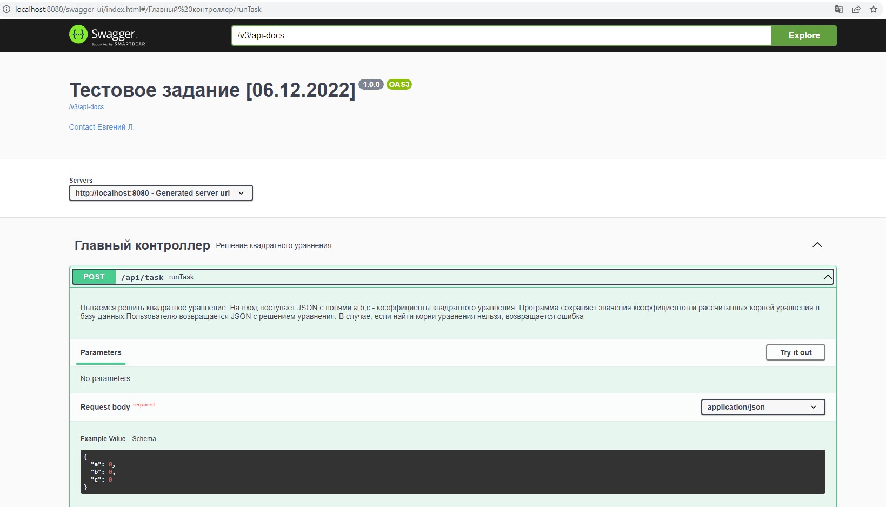

# My test task
## Evgeniy L.

Install the dependencies and start the server.

```sh
mvn clean install
mvn spring-boot:run
```

Verify the deployment by navigating to your server address in
your preferred browser.

```sh
http://localhost:8080/swagger-ui/index.html
```

